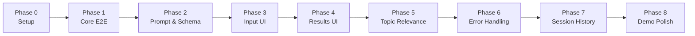

# MedLens — Phased Build Plan

## Vision

MedLens helps researchers and clinicians quickly understand medical research abstracts. Users paste an abstract, choose a summary length (Small / Medium / Detailed), optionally provide a topic keyword, and receive a structured, card-based summary powered by OpenAI.

**Hackathon constraint:** 2–2.5 hours total. Build the smallest complete working version first. Do not over-engineer.

## Architecture (MVP)

```
┌─────────────────────────────────────────────────────────┐
│                    Streamlit UI (app.py)                 │
│  ┌─────────────┐  ┌──────────────┐  ┌───────────────┐ │
│  │ Input Form  │  │ Results Cards│  │ Error Banners │ │
│  └──────┬──────┘  └──────▲───────┘  └───────────────┘ │
└─────────┼────────────────┼────────────────────────────┘
          │                │
          ▼                │
┌─────────────────┐  ┌────┴────────────┐
│ Prompt Builder  │  │ Response Parser │
│ (prompts.py)    │  │ (models.py)     │
└────────┬────────┘  └────▲────────────┘
         │                │
         ▼                │
┌─────────────────────────────────┐
│     OpenAI API Client           │
│     (llm.py)                    │
└─────────────────────────────────┘
         │
         ▼
┌─────────────────────────────────┐
│     .env (OPENAI_API_KEY)       │
└─────────────────────────────────┘
```

Single Python application. No database, auth, Docker, or vector store for MVP.

## Target File Structure (end state)

```
Medlens/
├── app.py                  # Streamlit entry point
├── config.py               # Env loading, constants
├── llm.py                  # OpenAI API client
├── prompts.py              # Domain-specific prompt templates
├── models.py               # Pydantic schemas for structured output
├── ui/
│   ├── input_form.py       # Abstract input, length, topic
│   ├── results.py          # Card-based result display
│   └── components.py       # Shared UI helpers (cards, headers)
├── requirements.txt
├── .env.example
├── .gitignore
├── Product.md
└── doc/                    # This folder
```

Phases may introduce files incrementally. Early phases may use a flatter structure (`app.py` only) and refactor later.

## Phase Overview



| Phase | Name | Est. Time | Must Have | Doc |
|-------|------|-----------|-----------|-----|
| 0 | Project Setup | 10 min | Yes | [phase-00](./phase-00-project-setup.md) |
| 1 | Core Summarization | 25 min | Yes | [phase-01](./phase-01-core-summarization.md) |
| 2 | Prompt & Schema | 20 min | Yes | [phase-02](./phase-02-prompt-and-schema.md) |
| 3 | Input UI | 15 min | Yes | [phase-03](./phase-03-input-ui.md) |
| 4 | Results UI | 20 min | Yes | [phase-04](./phase-04-results-ui.md) |
| 5 | Topic Relevance | 10 min | Yes | [phase-05](./phase-05-topic-relevance.md) |
| 6 | Error Handling | 15 min | Yes | [phase-06](./phase-06-error-handling.md) |
| 7 | Session History | 10 min | Optional | [phase-07](./phase-07-session-history.md) |
| 8 | Demo Polish | 10 min | Yes | [phase-08](./phase-08-demo-polish.md) |
| — | Future Enhancements | — | No | [phase-09](./phase-09-future-enhancements.md) |

**Total MVP (Phases 0–6 + 8):** ~2 hours  
**With optional Phase 7:** ~2.5 hours

## Build Order & Dependencies

### Critical Path (MVP Demo)

```
Phase 0 → Phase 1 → Phase 2 → Phase 3 → Phase 4 → Phase 5 → Phase 6 → Phase 8
```

- **Phase 1** proves the app can call OpenAI and return *something* for an abstract.
- **Phase 2** upgrades output to the required JSON schema with medical prompt rules.
- **Phases 3–4** split UI into professional input and card-based results.
- **Phase 5** adds optional topic relevance (already in schema from Phase 2; wired in UI here).
- **Phase 6** hardens validation and failure modes.
- **Phase 8** final demo pass.

### Optional

- **Phase 7** — only after Phase 6 is stable. Uses Streamlit `st.session_state`. No external DB.

### Out of Scope (Hackathon)

See [phase-09-future-enhancements.md](./phase-09-future-enhancements.md).

## Success Criteria (MVP)

From [Product.md](../Product.md) §18:

1. Paste medical abstract
2. Select Small / Medium / Detailed
3. Optionally enter topic/keyword
4. Generate summary successfully
5. Structured sections/cards (not one plain paragraph)
6. Key findings as bullet points
7. Topic relevance when topic provided
8. One-line relevance justification
9. Basic errors handled gracefully
10. Live demo without manual intervention

## Commands (after Phase 0)

```bash
# Install dependencies
pip install -r requirements.txt

# Configure API key
cp .env.example .env
# Edit .env and set OPENAI_API_KEY

# Run the app
streamlit run app.py
```

## Agent Build Instructions

When targeting a phase, use:

```
Build MedLens Phase N per doc/phase-0N-<name>.md
```

The agent should:

1. Read the phase doc and its dependencies
2. Implement only that phase's scope
3. Verify acceptance criteria before marking complete
4. Not implement features from later phases unless required as a minimal stub
